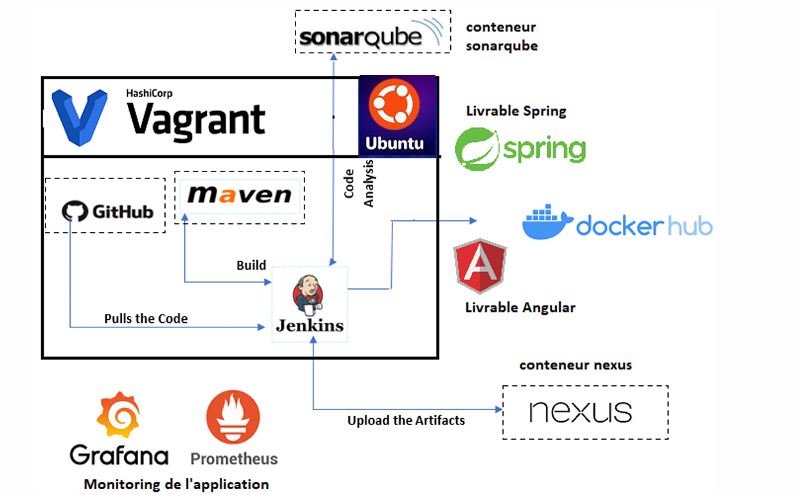

# 🚀 DevOps CI/CD Pipeline Project

This project showcases a complete CI/CD pipeline setup for automating the delivery of a **Spring Boot application**, focusing on best practices for code quality, containerization, monitoring, and deployment.

---

## 📖 Project Overview

Through this project, I explored the DevOps lifecycle and emphasized automation in modern software development. Below are the key technologies and tools utilized:

### 🔹 Key Features
1. **Environment Setup**:
   - Configured with **Vagrant** on **Ubuntu**, providing an isolated development workspace.
   
2. **Source Control & CI/CD**:
   - Used **GitHub** as the code repository and **Jenkins** to automate:
     - Pulling code from GitHub.
     - Building, testing, and analyzing the application.

3. **Build & Code Quality**:
   - Managed dependencies with **Maven** and generated coverage reports using **JaCoCo**.
   - Integrated **SonarQube** for code analysis to identify bugs and code smells.

4. **Artifact Management**:
   - Stored build artifacts in **Nexus**, ensuring versioned storage for reliable access.

5. **Containerization**:
   - Built Docker images and pushed them to **Docker Hub**, ready for deployment.

6. **Security Scanning**:
   - Scanned Docker images for vulnerabilities using **Trivy**.

7. **Monitoring**:
   - Implemented **Grafana** and **Prometheus** for detailed application metrics monitoring.

8. **Notifications**:
   - Configured **email notifications** for Jenkins job statuses.

---

## 🛠️ Architecture

The following architecture diagram illustrates the pipeline workflow from source code to deployment and monitoring:

---

## 📋 Pipeline Stages

Here's an overview of the CI/CD pipeline stages, automated with Jenkins:

1. **Code Pull**: Fetch code from GitHub.
2. **Build**: Compile the application with Maven.
3. **Test**: Run unit tests and generate code coverage reports.
4. **Code Analysis**: Analyze code quality with SonarQube.
5. **Artifact Deployment**: Push build artifacts to Nexus.
6. **Dockerization**: Build and push Docker images to Docker Hub.
7. **Vulnerability Scanning**: Scan Docker images for vulnerabilities with Trivy.
8. **Monitoring Setup**: Use Prometheus and Grafana for metrics and alerts.

---

## 🔍 Tools and Technologies

| **Tool**       | **Purpose**                                   |
|-----------------|-----------------------------------------------|
| **Vagrant**     | Environment setup                            |
| **Ubuntu**      | Operating system                             |
| **GitHub**      | Source control                               |
| **Jenkins**     | CI/CD orchestration                          |
| **Maven**       | Build management                             |
| **JaCoCo**      | Code coverage analysis                       |
| **SonarQube**   | Code quality analysis                        |
| **Nexus**       | Artifact repository                          |
| **Docker**      | Containerization                             |
| **Docker Hub**  | Image repository                             |
| **Trivy**       | Vulnerability scanning                       |
| **Grafana**     | Monitoring and visualization                 |
| **Prometheus**  | Metrics collection and monitoring            |

---

## 📸 Screenshots

### SonarQube Dashboard

### Docker Hub Repository

### Monitoring Insights
#### Prometheus

#### Grafana

### Email Notifications

---

## 🤝 Acknowledgments

This project provided valuable insights into the DevOps lifecycle, emphasizing the importance of automation in software development. Special thanks to my team and mentors for their support throughout this journey.

---

## 🚀 Future Enhancements

- Add Kubernetes integration for deployment.
- Implement advanced monitoring and alerting systems.
- Extend the CI/CD pipeline to support multi-environment deployments (e.g., staging and production).

---
